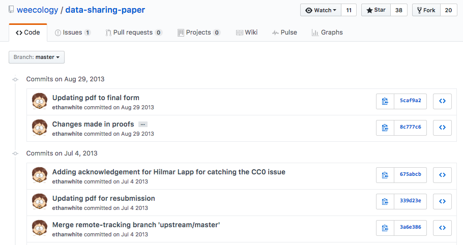
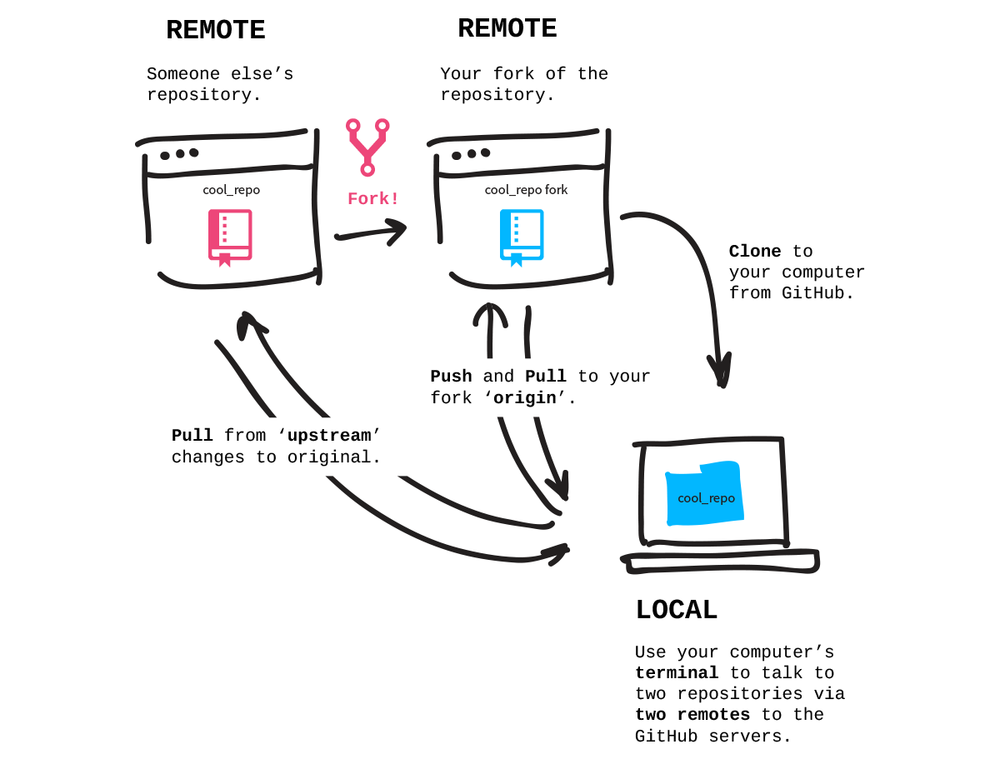

```{r, echo=FALSE, message=FALSE}
library(dplyr)
library(magick)
```
 
# Session Roadmap

<br>

### 1 Introductions 


#### - **get to know github** 

  - github as a computational research tool


### 2 Get stuck in


#### - [Collaborative github through rstudio](https://nhm-stars.github.io/materials/day04/evolottery.html) #EvoLottery (40 mins)
  - In this exercise, each participant will fork a github repo, and contribute a file required to simulate the **evolutionary trajectory of an imaginary species' body size**.
  
  - We'll use github to collate all species files and plot them all up together at the end! We'll also **discover the skull and beak shapes** associated with each simulated species size.


---


# GitHub 


## **version control technologies**

### **GitHub**

- #### More than a simple source code hosting service. 
    + Provides a dynamic and collaborative social coding platform  

<br>
<center>
 
</center>


---

# Modern scientific workflows


***can be overwhelming***


<br>

---


- #### **science increasingly computational**

    > demands for increased openness, transparency & reproducibility
    
- #### **science always benefits from collaboration**

    > push to harness the power of the internet 

<br>  

---

## BUT: succesful modern science workflows

***can be extremely powerful***


<br>
<br>

---


# GitHub for science

[](http://scfbm.biomedcentral.com/articles/10.1186/1751-0473-8-7)


> - ideal for managing the full suite of research outputs such as datasets, statistical code, figures, lab notes, and manuscripts.

> - supports peer review, commenting, and discussion. 

> - Diverse range of efforts, from individual to large bioinformatics projects, laboratory repositories, as well as global collaborations have found a home on GitHub

<br>

---

## **Rstudio for r users**


<br> 

**♡**


<br>
<br>

---


# **GitHub features**


>


---

## remote repositories

centralising information e.g. [**weecology** / ***"Nine simple ways to make it easier to (re)use your data" paper***](http://ojs.library.queensu.ca/index.php/IEE/article/view/4608/0)

[](https://github.com/weecology/data-sharing-paper)

<br>
---
## commits

traceability

[](https://github.com/ropensci/rfishbase/commits/master)

<br>
---

## issues

project management

[](https://github.com/weecology/data-sharing-paper/issues)

<br>
---

## graphs 

### project & team tracking

tracking contributors

[](https://github.com/weecology/data-sharing-paper/graphs/contributors)

---
tracking commits

[](https://github.com/weecology/data-sharing-paper/network)

<br>
---


# **entire process of project evolution reproducible**

<br>
<br>

---


## **more on github for science**

<br>

#### [**Ten Simple Rules for Taking Advantage of Git and GitHub**](https://www.ncbi.nlm.nih.gov/pmc/articles/PMC4945047/)

#### **Github as part of** [**Good Enough Practices in Scientific Computing**](https://arxiv.org/abs/1609.00037)

#### e.g [***My research workflow, based on Github***](https://status.github.com/images/invertocat.png) by [*Carl Boettiger*](https://twitter.com/cboettig)

<br>

---

## **Example `GitHub` uses**

[](https://www.ncbi.nlm.nih.gov/pmc/articles/PMC4945047/table/pcbi.1004947.t001/)

https://www.ncbi.nlm.nih.gov/pmc/articles/PMC4945047/


---

## **Practical: Github & Rstudio for collaborative coding**
### **#EvoLottery**

**Beak and skull shapes in birds of prey (“raptors”) are strongly coupled and largely controlled by size.** 


  - In this exercise, each participant will **fork a github repo**, and **contribute a file** required to simulate the *evolutionary trajectory of an imaginary species' body size*.


  - We'll use **github** to **collate all species files** and **plot** them all up together at the end! We'll also **discover the skull and beak shapes** associated with each simulated species size.

### [**Enter Practical**](https://annakrystalli.me/evolottery.html)

<https://annakrystalli.me/evolottery.html>

---

## RECAP Forking




---

# Back to our project.

We've initiated our project as a github repository but not connected it to remote repository on **GitHub**

In the **Evolottery** exercise we used a method of linking to a repository by **cloning** one that **already exists on GitHub**. Now we want to do the opposite.

```{r, eval=FALSE}
usethis::use_github()
```


*if for some reason it creates the repository on GitHub but doesn't push the contents, try running* `git push origin master` *in the terminal/shell*

---

There are **two very important documents misising in our repository** 

1. A README
2. A License

Let's go create an issue in our repository about this.


---

#### README

READMEs are the landing page of any repository on GitHub. 


```{r, eval=FALSE}
usethis::use_readme_md()
```
Creates a simple **`md`** README


```{r, eval=FALSE}
usethis::use_readme_rmd()
```
Creates an **`Rmd`** README in which you can run R examples and automatically creates the `README.md`.
- Render each time you make changes to `README.Rmd` so `README.md` is updated.


---

### License

```{r, eval=FALSE}
usethis::use_mit_license("Anna Krystalli")
```


```{r, echo=FALSE}
magick::image_read("../assets/LICENSE.png") %>% image_resize("200x700")
```


```{r, echo=FALSE}
magick::image_read("../assets/LICENSEmd.png") %>% image_resize("400x700")

```

---

### Referencing an issue in a commit message

#### You can **reference a specific issue using `#`** in a commit message to link it to that specific issue. 

eg `add README & LICENSE. Fix #1`

<br>

- **Commit all these files** that you just created, **referencing issue 1 (`#1`) in your commit message**.

- **Push** to GitHub

- Check out the issue to se what happened.

(N.B if you use the phrase **resolve #1**, GitHub will also close the issue `r emo::ji("+1")`)

---

## Publishing html to GitHub.

- If you haven't already published the rendered (.`html`) version of your report do so now.

- Head to GitHub and look for the **Settings** `r emo::ji("gear")`

- Scroll down to the **GitHub Pages** Section and set the **Source** to **`master branch`**.


---

Your repo is now hosting any html documents at the address given! 

The URL will be the URL given followed by the name of the file:


<http://annakrystalli.me/gapminderRR/gapminder-analysis.html>

---

# Recap


## GitHub amazing for:

- **fostering reproducibility**

- **empowering collaboration**

<br>

---

## GitHub tips


- Use [README](https://github.com/matiassingers/awesome-readme) to provide an overview of your project
- use issues to keep track of bugs, tasks, and enhancements
- include a [LICENSE](https://github.com/blog/1530-choosing-an-open-source-license)
- practice by collaborating with yourself on different machines!
- [handy github glossary](https://help.github.com/enterprise/11.10.340/user/articles/github-glossary/)


