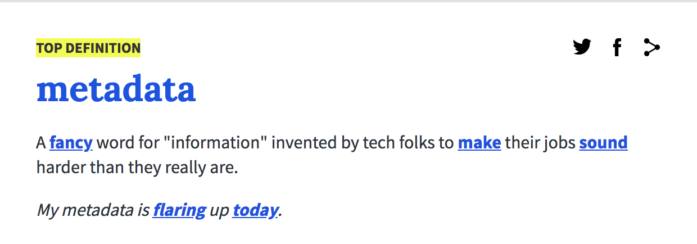
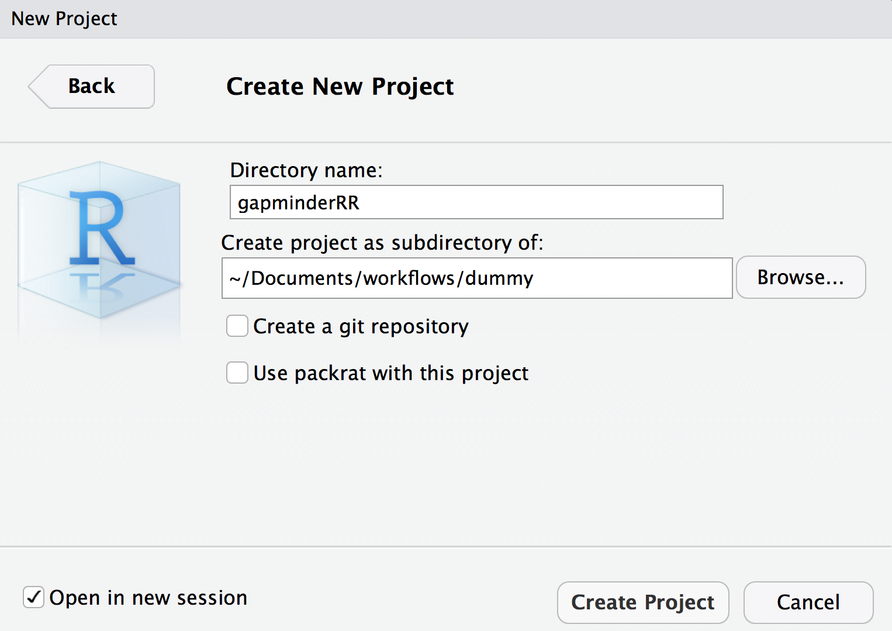

<script>window.twttr = (function(d, s, id) {
  var js, fjs = d.getElementsByTagName(s)[0],
    t = window.twttr || {};
  if (d.getElementById(id)) return t;
  js = d.createElement(s);
  js.id = id;
  js.src = "https://platform.twitter.com/widgets.js";
  fjs.parentNode.insertBefore(js, fjs);

  t._e = [];
  t.ready = function(f) {
    t._e.push(f);
  };

  return t;
}(document, "script", "twitter-wjs"));</script>

## You got data. Is it enough?

<blockquote class="twitter-tweet" data-conversation="none" data-lang="en"><p lang="en" dir="ltr"><a href="https://twitter.com/tomjwebb">@tomjwebb</a> I see tons of spreadsheets that i don&#39;t understand anything (or the stduent), making it really hard to share.</p>&mdash; Erika Berenguer (@Erika_Berenguer) <a href="https://twitter.com/Erika_Berenguer/status/556111838715580417">January 16, 2015</a></blockquote>
<script async src="//platform.twitter.com/widgets.js" charset="utf-8"></script>


<blockquote class="twitter-tweet" data-conversation="none" data-lang="en"><p lang="en" dir="ltr"><a href="https://twitter.com/tomjwebb">@tomjwebb</a> <a href="https://twitter.com/ScientificData">@ScientificData</a> &quot;Document. Everything.&quot; Data without documentation has no value.</p>&mdash; Sven Kochmann (@indianalytics) <a href="https://twitter.com/indianalytics/status/556120920881115136">January 16, 2015</a></blockquote>
<script async src="//platform.twitter.com/widgets.js" charset="utf-8"></script>

---

<blockquote class="twitter-tweet" data-conversation="none" data-lang="en"><p lang="it" dir="ltr"><a href="https://twitter.com/tomjwebb">@tomjwebb</a> Annotate, annotate, annotate!</p>&mdash; CanJFishAquaticSci (@cjfas) <a href="https://twitter.com/cjfas/status/556109252788379649">January 16, 2015</a></blockquote>
<script async src="//platform.twitter.com/widgets.js" charset="utf-8"></script>

<blockquote class="twitter-tweet" data-conversation="none" data-lang="en"><p lang="und" dir="ltr">Document all the metadata (including protocols).<a href="https://twitter.com/tomjwebb">@tomjwebb</a></p>&mdash; Ward Appeltans (@WrdAppltns) <a href="https://twitter.com/WrdAppltns/status/556108414955560961">January 16, 2015</a></blockquote>
<script async src="//platform.twitter.com/widgets.js" charset="utf-8"></script>

---

<blockquote class="twitter-tweet" data-lang="en"><p lang="en" dir="ltr">You download a zip file of <a href="https://twitter.com/hashtag/OpenData?src=hash">#OpenData</a>. Apart from your data file(s), what else should it contain?</p>&mdash; Leigh Dodds (@ldodds) <a href="https://twitter.com/ldodds/status/828657155863638016">February 6, 2017</a></blockquote>
<script async src="//platform.twitter.com/widgets.js" charset="utf-8"></script>

---

## **#otherpeoplesdata dream match!**

#### **Thought experiment: Imagine a dream open data set**
#### **How would you locate it?**

- what details would you need to know to determine relevance? 
- what information would you need to know to use it?


---


## **metadata = data about data**

> #### Information that **describes, explains, locates**, or in some way makes it easier to **find, access**, and **use** a resource (in this case, data). 



---

## **Data Reuse Checklist**

http://mozillascience.github.io/checklist/


---

## **Backbone of digital curation**


#### **Without it a digital resource may be irretrievable, unidentifiable or unusable**

---

### **Descriptive**

- enables **identification, location** and **retrieval** of data, often includes use of **controlled vocabularies** for classification and indexing.

### **Technical**

- describes the **technical processes** used to **produce**, or required to **use** a digital data object.

### **Administrative**

- used to manage **administrative aspects** of the digital object e.g. **intellectual property rights and acquisition.**


---

## **Elements of metadata**

- #### **Structured data files:**
    - readable by machines and humans, accessible through the web
- #### **Controlled vocabularies** eg. [NERC Vocabulary server](https://www.bodc.ac.uk/resources/products/web_services/vocab/)
    - allows for connectivity of data
    
### **KEY TO SEARCH FUNCTION**
- By structuring & adhering to controlled vocabularies, data can be **combined, accessed** and **searched!**
- **Different communities** develop **different standards** which define both the structure and content of metadata


---

### Identifying the right metadata standard

> Not an easy task

- **General:** Dublin Core Metadata Initiative [Specification](http://dublincore.org/specifications/)
- **[NERC Data Centers:](https://nerc.ukri.org/research/sites/data/)** Check with individual data centers for their metadata specification.
- **[Re3data.org](https://www.re3data.org/):** Registry of Research Data Repositories.

---

### **Seek help from support teams**

Most university libraries have assistants dedicated to Research Data Management:

<blockquote class="twitter-tweet" data-conversation="none" data-lang="en"><p lang="en" dir="ltr"><a href="https://twitter.com/tomjwebb">@tomjwebb</a> <a href="https://twitter.com/ScientificData">@ScientificData</a> Talk to their librarian for data management strategies <a href="https://twitter.com/hashtag/datainfolit?src=hash">#datainfolit</a></p>&mdash; Yasmeen Shorish (@yasmeen_azadi) <a href="https://twitter.com/yasmeen_azadi/status/556129700129800192">January 16, 2015</a></blockquote>
<script async src="//platform.twitter.com/widgets.js" charset="utf-8"></script>


My suggestion to you: **Ecological Metadata Language**

---

### [**Ecological Metadata Language (EML)**](http://www.dcc.ac.uk/resources/metadata-standards/eml-ecological-metadata-language) 
#### a metadata standard developed by and for the ecology discipline. 

EML is a [set of XML schema documents and controlled vocabularies](https://knb.ecoinformatics.org/#external//emlparser/docs/eml-2.1.1/index.html) that allow for the **structural expression of metadata**.


### Harmonising ecological data

**Wide adoption and use of EML will create exciting new opportunities for data discovery, access, integration and synthesis.**
 

\+ [eml2](https://github.com/cboettig/eml2) r pkg can help you build an `EML` object when you are ready from modular elements.

---

## EML

    - eml
      - dataset
        - creator
        - title
        - publisher
        - pubDate
        - keywords
        - abstract 
        - intellectualRights
        - contact
        - methods
        - coverage
          - geographicCoverage
          - temporalCoverage
          - taxonomicCoverage
        - dataTable
          - entityName
          - entityDescription
          - physical
          - attributeList
---

## **Organising data and metadata: the bare minimum**

### document `coverage` information

- **taxonomic coverage**: a table containing **taxonomic information on species in data**.
    - also record authority / source
- **temporal coverage**: temporal range and resolution details
- **spatial coverage**: 
    + a human readable geographic description of the study area
    + spatial range and resolution details
    + include depth (marine/freshwater) or altitudinal (terrestrial) information

Make sure to record units!

---

### document protocols in a `methods` document

Keep a dynamic document used to **plan**, **record** and **write up** methods. 

<blockquote class="twitter-tweet" data-conversation="none" data-lang="en"><p lang="en" dir="ltr"><a href="https://twitter.com/tomjwebb">@tomjwebb</a> record every detail about how/where/why it is collected</p>&mdash; Sal Keith (@Sal_Keith) <a href="https://twitter.com/Sal_Keith/status/556110605053349888">January 16, 2015</a></blockquote>
<script async src="//platform.twitter.com/widgets.js" charset="utf-8"></script>

**Any additional information other users would need to combine your data with theirs? Record it**
---

## variable `attribute` table.

### Maintain a metadata table of attributes for the variables in your data.

- description
- data type
- units
- description of date or factor data

---


## **`metadatar` package**

I'm developing a package to help with extracting information and creating simple metadata files that can form the basis of building more complex metadata formats (eg EML).

- extract info from dataset and create a `meta_tbl` in which to complete any further info required

```{r, eval=FALSE}
install.packages("devtools")
devtools::install_github("annakrystalli/metadatar")
```

---

```{r}
library(metadatar)
create_meta_shell(mtcars)
```


---

## **`attributes` columns**

I use recognized column headers shown here to make it easier to create an EML object down the line. I focus on the core columns required but you can add additional ones for your own purposes.

```{r}
names(create_meta_shell(mtcars))
```


---

### Attributes associated with all variables: 

- attributeName (required, free text field) 
- attributeDefinition (required, free text field)
- columnClasses (required, `"numeric"`, `"character"`, `"factor"`, `"ordered"`, 
    or `"Date"`, case sensitive)

<br>

---

### `columnClasses` dependant attributes 

- For `numeric` (ratio or interval) data:
    - unit (required, see [eml-unitTypeDefinitions](https://knb.ecoinformatics.org/#external//emlparser/docs/eml-2.1.1/./eml-unitTypeDefinitions.html) and [working with units](https://github.com/ropensci/EML/blob/master/vignettes/working-with-units.Rmd))
- For `character` (textDomain) data: 
    - definition (required)
- For `dateTime` data: 
    - formatString (required)
    e.g for date `11-03-2001` formatString would be `"DD-MM-YYYY"`
<br>

- I use the columns `code` and `levels` to store information on factors. I use `";"` to separate code and level descriptions. These can be extracted by `metadatar` function `extract_attr_factors()` later on.

---

# Example attribute table structure

## Start a new project to work in.
- Call it `gapminderRR`
- We will carry on in this project for the rest of the course




---

## Setup the `data/` folder

- Create a **`data/`** folder
- Within the **`data/`** folder create:
    + a **`raw/`** folder
    + a **`clean/`** folder
    + a **`metadata/`** folder

## Setup a `scripts/` folder

---

`gapminderRR` folder structure should look like this

```
.
├── data
│   ├── clean
│   ├── metadata
│   └── raw
├── gapminderRR.Rproj
└── scripts

```
  
---

```{r, message=FALSE, echo=F}
options(stringsAsFactors = FALSE)
knitr::opts_chunk$set(warning=FALSE, message=FALSE)
require(knitr)
library(tibble)

```

## **Data** 

In honour of Hans Rosling, we'll use the gapminder data, which has been made easily accessible for use by Jenny Bryan's [**`gapminder`** package](https://github.com/jennybc/gapminder).

First, let's install the package:

```{r, eval=FALSE}
install.packages("gapminder")
```

---

### Get the data

Let's have a look:

```{r}
gapminder::gapminder
```

---

- Like many real data sets, column headings are convenient for data entry and manipulation, but **not particularly descriptive to a user not already familiar with the data**. 

- More importantly, they **don't let us know what units they are measured in** (or in the case of categorical / factor data, **what the factor abbreviations refer to**). So let us take a moment to be more explicit:

---

### Get the data

Let's open a script to work in and write a copy of the data to our **`raw`** data folder.

- use function `here` in package `here` to create robust pathways relative to the **project root**)
- use `::` access a function from a package without loading the whole thing through `library()`

```{r, eval=FALSE}
install.packages("here")
install.packages("tidyverse")
readr::write_csv(gapminder::gapminder, path = here::here("data/raw/gapminder.csv"))
```

From now on we'll pretend the `gapmnider.csv` is our raw data we have on disk. So let's read it in and start documenting it.


```{r}
gapminder_df <- readr::read_csv(here::here("data/raw/gapminder.csv"))
```


---

### double check the data

```{r}
gapminder_df
```


---

## **Create `meta_tbl` shell**

We can use function `create_meta_shell()` to create a metadata shell for our `gapminder_df` dataset.

```{r, eval=FALSE}
?create_meta_shell
```


```{r}
metadatar::create_meta_shell(gapminder_df, factor_cols = c("country", "continent"))
```
We specify that `"country"` and `"continent"` are columns that contain factors and the function automatically extracts and collapses the codes and levels for us.

---

### Create and save `gapminder_meta_shell.csv`


```{r}
gapminder_meta_shell <- metadatar::create_meta_shell(gapminder_df, 
                                               factor_cols = c("country", "continent"))

```

```{r eval=F}
write.csv(gapminder_meta_shell, file = here::here("data/metadata/gapminder_meta_shell.csv"), 
          row.names = F)
```

---

## Exercise: Complete the metadata shell.

- Create a new script to work in in the `scripts/` folder. Save it as `helper01_create-metadata.R`

- Create a metadata table shell and save it in the `metadata/` folder as **gapminder_meta_shell.csv**

- complete in your prefered spreadsheet editing software and save to **gapminder_meta.csv**
    + Consult the documentation in the [`gapminder` pkg GitHub repository](https://github.com/jennybc/gapminder) for information on the dataset.


