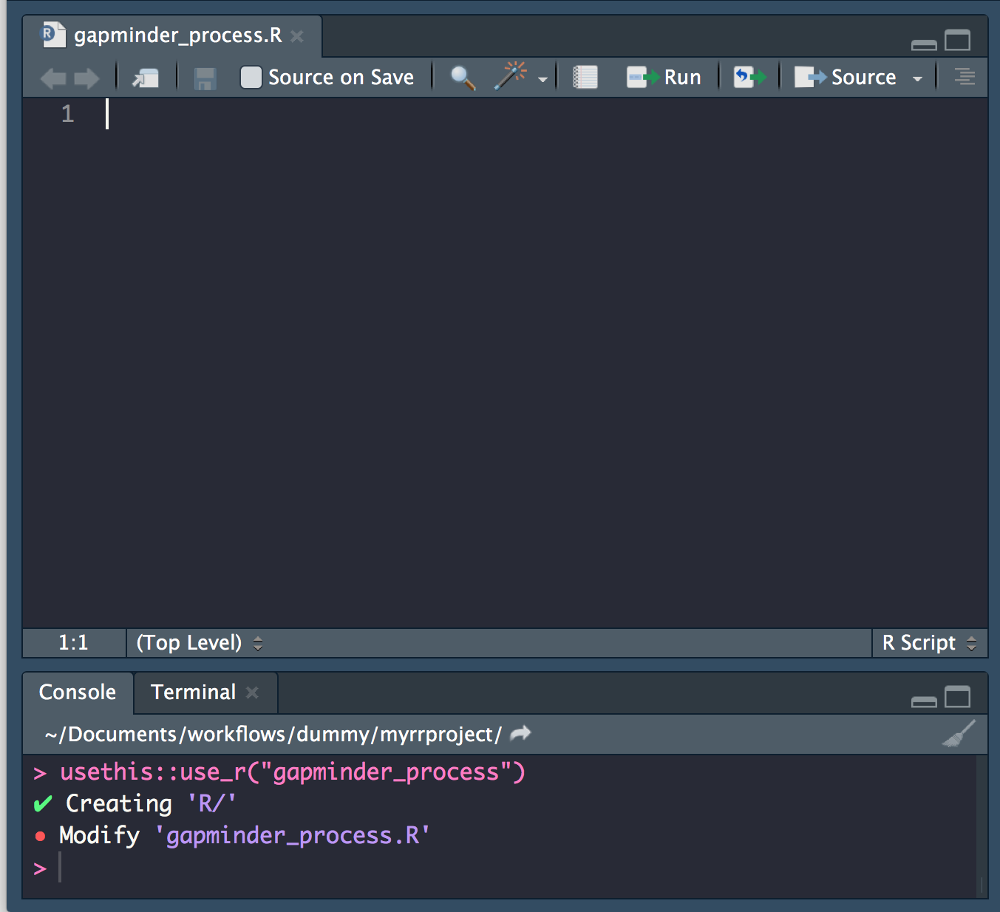
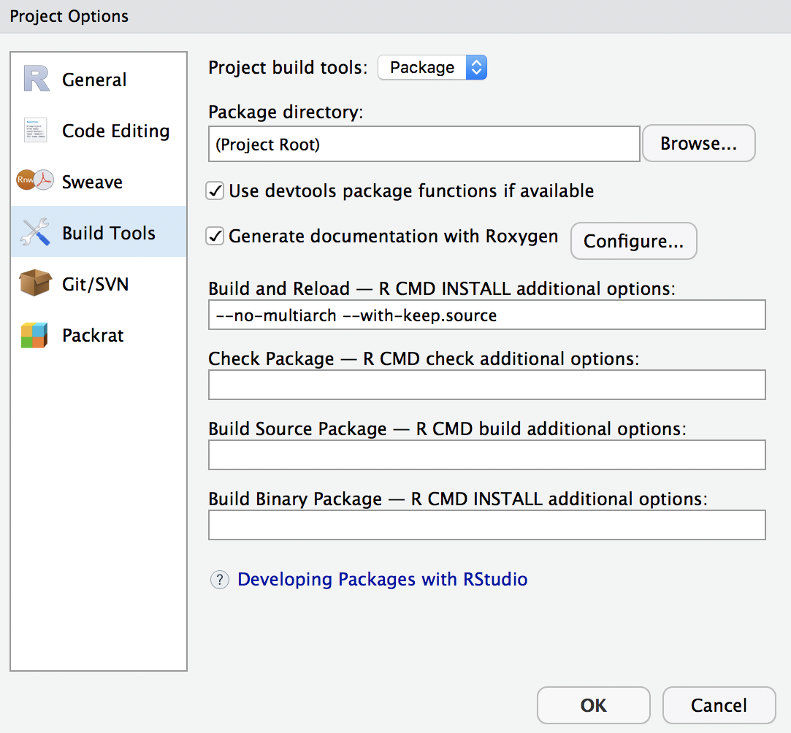
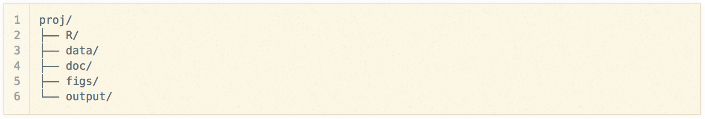

# Project Organisation

Good project layout helps ensure the

- Integrity of data
- Portability of the project
- Easier to pick the project back up after a break

---

## From raw to analytical data

### [the reproducible pipeline](https://dynamicecology.wordpress.com/2016/08/22/ten-commandments-for-good-data-management/)

- Do not manually edit raw data

- Keep a clean pipeline of data processing from raw to analytical.


- Ideally, incorporate checks to ensure correct processing of data through to analytical.

---

## Separate function definition and application

- When your project is new and shiny, the script file usually contains many lines of directly executated code. 

- As it matures, **reusable chunks get pulled into their own functions**. 

- The actual analysis scripts then become relatively short, and use the functions defined in separate R scripts. 

---

## Use Rstudio projects

### Keep your work [tidy, portable and self-contained](https://nicercode.github.io/blog/2013-04-05-projects/)


### pkg `here`

Use function `here::here("path", "to", "file")` to create robust paths **relative to the project root**. 

eg

```{r}
here::here("path", "to", "file")
```

---

# File system organisation

### What I would previously told you:

> #### **Just pick a sensible / standardised file system structure and stick to it**


```{r, echo=F, message=F, warning=F}
library(magick)
library(dplyr)
```

---

### What I try to teach now:

Here I will show the approach advocated in **Marwick B, Boettiger C, Mullen L. (2018)** ***Packaging data analytical work reproducibly using R (and friends)*** PeerJ Preprints 6:e3192v2 [https://doi.org/10.7287/peerj.preprints.3192v2](https://peerj.com/preprints/3192/)

<blockquote><small><strong>Abstract</strong> Computers are a central tool in the research process, enabling complex and large scale data analysis. As computer-based research has increased in complexity, so have the challenges of ensuring that this research is reproducible. To address this challenge, we review the concept of the research compendium as a solution for providing a standard and easily recognisable way for organising the digital materials of a research project to enable other researchers to inspect, reproduce, and extend the research. We investigate how **the structure and tooling of software packages of the R programming language are being used to produce research compendia in a variety of disciplines**. We also describe how software engineering tools and services are being used by researchers to streamline working with research compendia. Using real-world examples, we show how researchers can improve the reproducibility of their work using research compendia based on R packages and related tools.</small></blockquote>

---

## A reproducible research compendium

Proposal for a reproducible research compendium:

[_Wickham, H. (2017) Research compendia. Note prepared for the 2017 rOpenSci Unconf_](https://docs.google.com/document/d/1LzZKS44y4OEJa4Azg5reGToNAZL0e0HSUwxamNY7E-Y/edit#heading=h.blggi16hdosp)


---

#### A ***minimal*** analysis project in R would consist of:

1. An **`scripts/`** directory that contains R scripts (`.R`), notebooks (`.Rmd`), and intermediate data.

2. A **`DESCRIPTION`** file that provides metadata about the compendium. Most importantly, it would list the packages needed to run the analysis. Would contain field to indicate that this is an analysis, not a package.


--- 


#### A ***reproducible*** analysis project would also contain:

1. An **`R/`** directory which contains R files that provide high-stakes functions.

1. A **`data/`** directory which contains high-stakes data.

1. A **`tests/`** directory that contains unit tests for the code and data.

1. A **`vignettes/`** directory that contains high-stakes reports.

1. A **build system** which executes the contents of `scripts/` and `vignettes/`, producing final data and reports.

---

#### Some other components would be automatically added/generated:

1. A **`.Rbuildignore`** file that ignores the `scripts/` directory.  

1. A **`man/`** directory which contains **roxygen2-generated documentation** for the reusable functions and data.

#### A ***shareable*** reproducible analysis project would also:

- Use Git + GitHub (or other public Git host)

- Use Travis or other continuous integration service

- Capture the computational environment so it can easily be recreated on a different computer. This involves at a minimum capturing package versions, but might also include capturing R version, and other external dependencies.

---

# R package file system structure for reproducible research

### - Take advantage of the power of convention.

### - Make use of great package development tools.


---

## Convention

> It’s like agreeing that we will all drive on the left or the right. A hallmark of civilization is following conventions that constrain your behavior a little, in the name of public safety.

**Jenny Bryan** on [Project-oriented workflows](https://www.tidyverse.org/articles/2017/12/workflow-vs-script/)


> ### A place for everything, everything in its place.

Benjamin Franklin


---

### The benefits of following convention:

- You will be able to find your way around any of your projects

- You will be able to find your way around any project by others following same convention

- You will be able to find your way around any r package on GitHub!

---

## Tools

### Leverage tools and functionality for **R package development**
- manage dependencies
- make functionality available
- document functionality
- validate functionality
- version contol your project


[`devtools`](https://www.tidyverse.org/articles/2017/11/usethis-1.0.0/), [`usethis`](https://www.tidyverse.org/articles/2017/11/usethis-1.0.0/),
[`rrtools`](https://github.com/benmarwick/rrtools),
[Rstudio](https://support.rstudio.com/hc/en-us/articles/200486488-Developing-Packages-with-RStudio)

```{r, eval=FALSE}
install.packages(c("devtools", "usethis"))
```


---

# Applying conventions to our project

## Functions in the **`R/`** dir

Create new function scripts using `usethis::use_r("functionality-name")`

```{r, eval=FALSE}
usethis::use_r("gapminder_process")
```



---

```
.
├── R
│   └── gapminder_process.R
├── data
│   ├── clean
│   ├── metadata
│   │   ├── gapminder_meta.csv
│   │   └── gapminder_meta_shell.csv
│   └── raw
│       └── gapminder.csv
└── gapminderRR.Rproj
└── scripts
    └── helper01_create-metadata.R
```


---

### I've written two functions to work with the gapminder data:

- `rel_pop_get`: takes a single country subset of the gapminder dataframe and calculates relative population compared to the population in that country at the base_year  


```{r}
rel_pop_get <- function(df, base_year){
    df$pop_rel <- df$pop/df$pop[df$year == base_year]
    df
}
```

---

- `gapmider_rel_pop`: does a few checks with respect to `base_year` and if all is good, applies `rel_pop_get` to the subset data of each country.  


```{r, eval=FALSE}
gapmider_rel_pop <- function(gapminder_df, base_year = 1952) {
    
    # check that the base year is a valid year. 
    valid_b_y <- base_year %in% unique(gapminder_df$year) & is.numeric(base_year)
    if (!valid_b_y) {
        stop("base_year ", base_year,
             " not a valid year in gapminder dataset. \nValid years are: ", 
             paste(unique(gapminder_df$year), collapse = ","))
        }
    
    # group by country and calculate population relative to baseline year
    gapminder_df %>%
        dplyr::filter(year >= base_year) %>% 
        dplyr::group_by(country) %>% dplyr::do(rel_pop_get(., base_year)) %>%
        dplyr::ungroup()
}
```


---

### Roxygen2 documentation

`Roxygen2` allows you to write specially-structured comments preceding each function definition. These are processed automatically to produce `.Rd` help files for your functions and control which are exported to the name space.

See Karl Broman's blogpost on [writing Roxygen2 documentation](http://kbroman.org/pkg_primer/pages/docs.html)


```{r, eval=FALSE}
install.packages("roxygen2")
```


---

#### Insert Roxygen skeleton

In Rstudio, you can insert a roxygen skeleton by placing the cursor anywhere in the definition of a function, then clicking:

```
Code > Insert Roxygen Skeleton

```

---

```{r, eval=FALSE}
#' Title
#'
#' @param gapminder_df 
#' @param base_year 
#'
#' @return
#' @export
#'
#' @examples
gapmider_rel_pop <- function(gapminder_df, base_year = 1952) {
    
    # check that the base year is a valid year. 
    valid_b_y <- base_year %in% unique(gapminder_df$year) & is.numeric(base_year)
    if (!valid_b_y) {
        stop("base_year ", base_year,
             " not a valid year in gapminder dataset. \nValid years are: ", 
             paste(unique(gapminder_df$year), collapse = ","))
    }
    
    # group by country and calculate population relative to baseline year
    gapminder_df %>%
        dplyr::filter(year >= base_year) %>% 
        dplyr::group_by(country) %>% dplyr::do(rel_pop_get(.)) %>%
        dplyr::ungroup()
}
```


---


### Roxygen basics

- `roxygen` notation indicated by **beginning line with `#'`**.

- **First line** will be the **title** for the function.

- After title, include a blank `#'` line and then write a **longer description.**

- `@param argument_name` **description of the argument.**

- `@return` description of **what the function returns.**

- `@export` tells `Roxygen2` to **add this function to the `NAMESPACE`** file, so that it will be **accessible to users.** 

- `@importFrom pkgname functionname` imports a function directly from another package, allowing us to use it without specifying the namespace (ie without using `::`). Here, by using `@importFrom dplyr %>%` I'm importing the pipe so I can use it directly in the function.

---


#### Complete Roxygen documentation

```{r eval=FALSE}
#' Calculate population relative to a baseline year
#'
#' Calculate population at different timepoints, for each country in the gapminder 
#' dataset relative to a baseline year. Append result to the dataframe as a new column.
#' @param gapminder_df dataframe of gapminder data
#' @param base_year numeric. Year to be taken as baseline for the calculation of 
#' of relative population change
#'
#' @return gapminder_df with relative population added as column pop_rel 
#' @export
#'
#' @importFrom dplyr %>%
#' @examples
gapmider_rel_pop <- function(gapminder_df, base_year = 1952) {
    
    # check that the base year is a valid year. 
    valid_b_y <- base_year %in% unique(gapminder_df$year) & is.numeric(base_year)
    if (!valid_b_y) {
        stop("base_year ", base_year,
             " not a valid year in gapminder dataset. \nValid years are: ", 
             paste(unique(gapminder_df$year), collapse = ","))
        }
    
    # group by country and calculate population relative to baseline year
    gapminder_df %>%
        dplyr::filter(year >= base_year) %>% 
        dplyr::group_by(country) %>% dplyr::do(rel_pop_get(.)) %>%
        dplyr::ungroup()
}
```


---

I'm not exporting this function so full documentation is not necessary


```{r}
# calculate population relative to a baseline year from gapminder single country 
# subset
rel_pop_get <- function(df) {
    df$pop_rel <- df$pop/df$pop[df$year == base_year]
    df
}
```


---

## Exercise: write & document a function

- Create a **new `.R` script using `usethis::use_r()`**.

- **Copy the two functions** I created above (including the Roxygen documentation)

- Write an additionl function that takes `gapminder_df` after relative population has been calculated, **calculates the % change compared to the baseline population** in different years, adds it as new column `pop_perc` to `gapminder_df` and returns the whole dataframe.

(Hint a relative population of 1, represents 0% change) 
    
- Document it appropriately so that it is exported.

---

## Add [`DESCRIPTION`](http://r-pkgs.had.co.nz/description.html) file

The job of the DESCRIPTION file is to store important metadata about our analysis package.

```{r, eval=F}
usethis::use_description()
```


```
.
├── DESCRIPTION
├── R
│   └── gapminder_process.R
├── data
│   ├── clean
│   ├── metadata
│   │   ├── gapminder_meta.csv
│   │   └── gapminder_meta_shell.csv
│   └── raw
│       └── gapminder.csv
└── gapminderRR.Rproj
└── scripts
    └── helper01_create-metadata.R
```
---

### `DESCRIPTION` file skeleton


```
Package: gapminderRR
Version: 0.0.0.9000
Title: What the Package Does (One Line, Title Case)
Description: What the package does (one paragraph).
Authors@R: person("First", "Last", email = "first.last@example.com", role = c("aut", "cre"))
License: What license is it under?
Encoding: UTF-8
LazyData: true
ByteCompile: true

```
---

### `DESCRIPTION` file complete

```
Package: gapminderRR
Version: 0.0.0.9000
Title: Analysing gapminder data to teach reproducible research in R
Description: Analysing gapminder data to teach reproducible research in R. In 
    particular, we cover using r package development tools and conventions using usethis, 
    devtools and rrtools, literate programming using rmarkdown and version control through 
    git and github.
Authors@R: person("Anna", "Krystalli", email = "annakrystalli@googlemail.com", role = c("aut", "cre"))
License: What license is it under?
Encoding: UTF-8
LazyData: true
ByteCompile: true
RoxygenNote: 6.0.1

```

---

### Configure build tools to treat our project as an **R package**!

- Click on **Build > Configure build tools > package** 




---
    
- Restart RStudio for the package **Build** tab to appear
  ```
  Session > New Session
  ```

- In the **Build** tab, click `more > Clean and Rebuild`

---

```
.
├── DESCRIPTION
├── NAMESPACE
├── R
│   └── gapminder_process.R
├── data
│   ├── clean
│   │   └── gapminder.csv
│   ├── metadata
│   │   ├── gapminder_meta.csv
│   │   └── gapminder_meta_shell.csv
│   └── raw
│       └── gapminder.csv
├── gapminderRR.Rproj
├── man
│   └── gapmider_rel_pop.Rd
└── scripts
    └── helper01_create-metadata.R
```

---

### Our package is now functional!!!

Try `?gapmider_rel_pop`!!

Or

```{r eval=FALSE}

gapmider_rel_pop(gapminder::gapminder)

```

---

### Check package integrity

Click on the **Check** button (`r emo::ji("clipboard")` `r emo::ji("white_check_mark")`)


---

## Managing dependencies

So far we have one dependency, package `dplyr`. How can we make sure it is available when someone wants to reproduce our work and use our functions? Already our package build checks are complaining at us!

### 3 ways, from least to most robust:

- Using package `pacman`

- Using a `DESCRIPTION` file (the approach we will use)

- Using package `packrat`


---

### `pacman`

Nice package that can install (if required) and load specified packages.

Here's a snippet of code that can do this:

```{r eval=FALSE}
#' install and load dependencies through pkg "pacman"
pkgs <- c("dplyr")
if (!require("pacman")) { install.packages("pacman") }
pacman::p_load(pkgs, character.only = T)

```

Can't specify the exact version of the package installed (defaults to the latest version on CRAN).

---

### `packrat`

**Creates a local library of packages used in an analysis within the project.**

- **Isolated:** Installing a new or updated package for one project won’t break your other projects, and vice versa. That’s because packrat gives each project its own private package library.

- **Portable:** Easily transport your projects from one computer to another, even across different platforms. Packrat makes it easy to install the packages your project depends on.

- **Reproducible:** Packrat records the **exact package versions** you depend on, and ensures those exact versions are the ones that get installed wherever you go.


Packrat definitely worth consideration (see [pkg documentation](https://rstudio.github.io/packrat/) and [**managing dependencies section**](9https://www.britishecologicalsociety.org/wp-content/uploads/2017/12/guide-to-reproducible-code.pdf) in Programming chapter of BES Guide to Reproducible Code in Ecology and
Evolution. BUT it can significantly increase the size of projects and functionality siloed.


---

### `DESCRIPTION`

We can add dependendencies to our description file using function `usethis::use_package()`

```{r, eval=FALSE}
usethis::use_package("dplyr")

```

We can specify minimum version requirements but not the exact version of a package.

---

### imports

- **`dplyr`** has now been added to **Imports:**

```
Package: gapminderRR
Version: 0.0.0.9000
Title: Analysing gapminder data to teach reproducible research in R
Description: Analysing gapminder data to teach reproducible research in R. In 
    particular, we cover using r package development tools and conventions using usethis, 
    devtools and rrtools, literate programming using rmarkdown and version control through 
    git and github.
Authors@R: person("Anna", "Krystalli", email = "annakrystalli@googlemail.com", role = c("aut", "cre"))
License: What license is it under?
Encoding: UTF-8
LazyData: true
ByteCompile: true
RoxygenNote: 6.0.1
Imports: 
    dplyr


```

Try running the checks again now.

---

# FALL BACK!

If this confused you too much:

1. Sorrrrrryyy!!!!

2. Check out this excellent blogpost by Rich Fitzjohn on [**Designing projects**](https://nicercode.github.io/blog/2013-04-05-projects/) that is a simple version of what we just tried to do (minus the package functionality).


