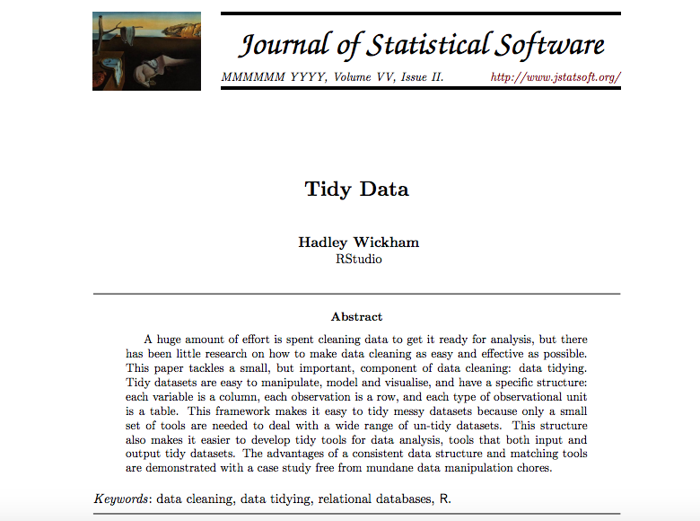
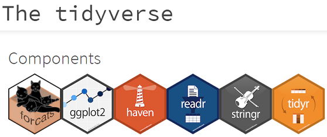

Hadley Wickam's paper on Tidy Data

<http://www.jstatsoft.org/v59/i10/paper>

---

## Principles of tidy data 

### tidy data structure

  - **One variable per column**.
  - **One row per observation**.

---

### **why?**

#### Tidy datasets are easy to manipulate, model and visualise

While one can do the exact same analyses with tidy and messy datasets/tools, the tidy approach will generally require much less code, and hence be faster to write, easier to debug, and easier to modify/maintain.

### Play well with the [tidyverse](https://www.tidyverse.org/) pkgs!





> Best to record data in tidy format but package `tidyr` provides functions to tidy untidy data

---

## Install tidyr

```{r, message=F, eval=FALSE}
install.packages("tidyverse")
```

if you are asked about storing to a personal library just type 'y' (yes)


```{r, message=FALSE, warning=FALSE}
library(tidyr)
library(dplyr)
```

---

## Examples of messy data

- #### Column headers are values, not variable names.

- #### Multiple variables are stored in one column.

- #### Variables are stored in both rows and columns.

- #### Multiple types of observational units are stored in the same row.


---

## Most messy datasets can be tidied with a small set of tools:

### **gathering**, **separating** and **spreading**. 

---

## 1 - wide data

### one variable over many columns

In this experiment three (rather unusually named) people were given two different drugs (a and b) and their heart rate was recorded:

```{r, echo=FALSE}
messy <- data.frame(
  name = c("Wilbur", "Petunia", "Gregory"),
  a = c(67, 80, 64),
  b = c(56, 90, 50)
)
```

```{r}
messy
```


**How many variables have we got?**
**A sensible model we might want to fit:**


```heart rate ~ drug```


How can we supply the data to a modelling function? (e.g. ```lm()```)


---

## 1 - wide data

We use the function ```gather()``` in the tidy package to reshape the dataframe from wide to long format


```gather(data, key, value, ..., na.rm = FALSE, convert = FALSE)```

- ```data``` : **a data frame**
- ```key``` : **name for the identifier of the columns to gather** 
- ```value```: **name for the new variable being created**
- ```...```:  **select the columns to be stacked**
    + <small>you can use ```:``` to select all variables between two columns.</small> 
    + <small>use bare variable names (ie " " not required).</small>

```{r}
tidy  <- gather(data = messy, key = drug, value = heartrate, a:b)
```

---

## 1 - wide data

```{r}
tidy
```

```heart rate ~ drug```

---

## 2 - clumped data 
### more than one variable in a single column

In this study, parasite counts were made on samples taken from 3 elephant faecal boluses and two locations 

```{r, echo = F}
messy <- data.frame(
  id = rep(1:2, each = 6),
  spl.id = paste(rep(rep(1:3, each = 2),2), c("centre", "outer"), sep = "-"),
  counts = rnbinom(12, mu = 2, size = 15)
)
```

```{r}
head(messy)
```


---

## 2 - clumped data
### more than one variable in a single column

We use ```separate()``` to split ```spl.id``` into ```bolus``` and ```location```, using a regular expression to describe the character that separates them.

```separate(data, col, into, sep , remove = TRUE, convert = FALSE, extra = "error", ...)```

- ```data``` : **a data frame**
- ```col``` : **name of column to split** 
- ```into``` : **name for the new variable being created** (as character vector)
- ```sep```:  character as regular expression to match to any **non-alphanumeric** values
    + numeric indicates position of split
    + **length of ```sep``` should be one less than length of ```into```**

```{r}
tidy <- separate(data = messy, into = c("bolus", "location"), col = spl.id, sep= "-")
```

---

## 2 - clumped data 
### more than one variable in a single column

```{r}
tidy
```


---

## 3 - Combination of messy data

In this study, the time people spent on their phones was measured at two locations (work and home) and at two time points.

```{r, echo=FALSE}
messy <- data.frame(
  id = 1:4,
  trt = sample(rep(c('control', 'treatment'), each = 2)),
  work.T1 = runif(4),
  home.T1 = runif(4),
  work.T2 = runif(4),
  home.T2 = runif(4)
)

```

```{r}
messy
```

---

## 3 - Combination of messy data

First we first use ```gather()``` to turn columns ```work.T1```, ```home.T1```, ```work.T2``` and ```home.T2``` into a key-value pair of key and time. 

```{r}

tidier <- gather(data = messy, key = key, value = time, -id, -trt)
tidier
```


---

## 3 - Combination of messy data

Next we use ```separate()``` to split the key into ```location``` and ```time```, using a regular expression to describe the character that separates them.


```{r}

tidy <- separate(data = tidier, col = key, into = c("location", "timepoint"), sep = "\\.") 

tidy
```


---


## exercise: tidy 3 example data

#### Instructions & data are in this [OSF project](https://osf.io/kc4mf/)


### best to get organised

- create a new project (`File > New Project > New Directory > New Project > tidydata`)
- create a folder named `data/` in your project
    + get the data from the **OSF project**
- create a new script, e.g. `tidy.R`
- #### tidy the data!


RStudio Data wrangling [cheat sheet](https://www.rstudio.com/wp-content/uploads/2015/02/data-wrangling-cheatsheet.pdf)


